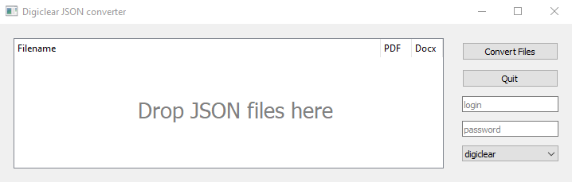
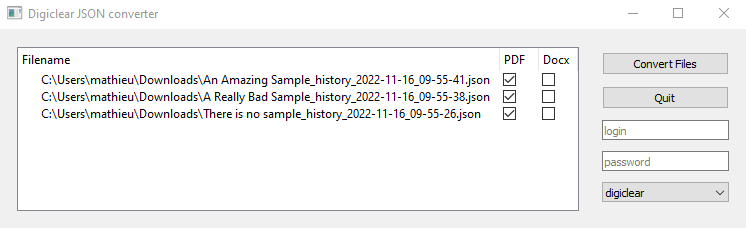

.. default-domain:: py

.. _quickstart:

Basic Usage
============

.. _GUIUsage:

Using the GUI
-------------

If you use the standalone version, you can simply run the executable file to open the GUI. 
Alternatively, if you installed the python module, you can either:

	* Open a command prompt and type ``digiclearjsonconverter`` (the command is not case sensitive).
	
	* Run the python GUI file 

You should see the following interface opening up.
	

The usage is straightforward. Simply download the JSON files you want from digiclear. Drag and drop then in the center panel:

So far only PDF export is available. Export to Docx or other format to allow users to easily change the layout of the report could be implemented. 
Fill in your digiclear credentials, and click on `Convert`. PDF files will be generated in the same directory as the JSON files. 

.. _PythonUsage:

Python scripting
-----------------

You can also use the converter within a python script. A basic example is included in the `examples` directory::

	from DigiclearJSONConverter.digiclearconnection import DigiclearConnection
	from DigiclearJSONConverter.operationhistory import OperationHistory
	from DigiclearJSONConverter.pdfreport import PDFReport
	from pathlib import Path
	this_dir = Path(__file__).parent ## current directory where the file is

	username = 'prenom.nom' ### your digiclear username
	password = 'password' ### your digiclear password
	digiclear_servername = 'digiclear' ## digiclear, remoteclear or remoteclear-lan

	####### to run in the current directory
	# sourcedirectory = this_dir
	####### to get json files from another directory
	sourcedirectory = Path(r'directory_with_jsonfiles')

	####### list json files matching the pattern
	jsonfilelist = list(sourcedirectory.glob('*_history_*.json')) 

	### connect to Digiclear
	s = DigiclearConnection(digiclear_servername)
	if digiclear_servername in ['digiclear', 'remoteclear']:
		check_certificate = True
	elif digiclear_servername == 'remoteclear-lan':
		check_certificate = False
	test = s.login(username, password, check_certificate) ## False for remoteclear-lan 
	if not test:
		print('\n login failed \n')

	### do the actual conversion
	if len(jsonfilelist)>0:
		for jsonfilepath in jsonfilelist:
			outfilename = jsonfilepath.name.replace('json','pdf') ## output file name
			outfilepath = Path(jsonfilepath.parent, outfilename).__str__() ## output file path as str
			Operation_Dict = OperationHistory(jsonfilepath, digiclearconnection = s) ## get all info
			Report = PDFReport(Operation_Dict.report_dict, outfilepath) ## write to pdf

	s.disconnect() ## close connection do digiclear

Let's break it down to the important parts. 
First, after installation, the import section is straightforward::

	from DigiclearJSONConverter.digiclearconnection import DigiclearConnection
	from DigiclearJSONConverter.operationhistory import OperationHistory
	from DigiclearJSONConverter.pdfreport import PDFReport
	from pathlib import Path
	this_dir = Path(__file__).parent ## current directory where the file is

The :py:class:`DigiclearConnection <DigiclearJSONConverter.digiclearconnection.DigiclearConnection>` class handles the authentication and connection to the Digiclear server, to pass API calls and collect information that is not in plain text in the json file.
:py:class:`OperationHistory <DigiclearJSONConverter.operationhistory.OperationHistory>` generates a sorted dictionnary of operations from which a report can be constructed. :py:class:`PDFReport <DigiclearJSONConverter.pdfreport.PDFReport>` uses `Reportlab <https://docs.reportlab.com/>`_ to produce a PDF from the operation history dictionnary.
The two last lines of the snippet above store the location of the script itself, for future use if needed.

It is followed by the authentication information::

	username = 'prenom.nom' ### your digiclear username
	password = 'password' ### your digiclear password
	digiclear_servername = 'digiclear' ## digiclear, remoteclear or remoteclear-lan

We can then look for `json` files either in the current directory or in a specified directory by properly commenting/decommenting the lines::

	####### to run in the current directory
	# sourcedirectory = this_dir
	####### to get json files from another directory
	sourcedirectory = Path(r'directory_with_jsonfiles')

	####### list json files matching the pattern
	jsonfilelist = list(sourcedirectory.glob('*_history_*.json'))

and stores all their paths in the :code:`jsonfilelist` list.
We then open a connection to digiclear ::

	### connect to Digiclear
	s = DigiclearConnection(digiclear_servername)
	if digiclear_servername in ['digiclear', 'remoteclear']:
		check_certificate = True
	elif digiclear_servername == 'remoteclear-lan':
		check_certificate = False
	test = s.login(username, password, check_certificate) ## False for remoteclear-lan
	if not test:
		print('\n login failed \n')

.. note::
	:code:`remoteclear` and :code:`remoteclear-lan` are test servers. If you wish to contribute, you should first try your code using these instead of running tests directly on digiclear. :code:`remoteclear` is only accessible from outside the C2N internal network, while :code:`remoteclear-lan`  is only accessible from the C2N internal network. Certificate checks are disabled for remoteclear-lan.

The conversion is then peformed in the loop for each file::

	outfilename = jsonfilepath.name.replace('json','pdf') ## output file name
	outfilepath = Path(jsonfilepath.parent, outfilename).__str__() ## output file path as str

will set the output file name so that the PDF file is produced in the same directory as the `json` file.
We gather all operations on the sample, and look for relevant information using API call with::

	Operation_Dict = OperationHistory(jsonfilepath, digiclearconnection = s) ## get all info

which generates an ordered dictionnary :code:`Operation_Dict`. Finally, we write the report as a PDF file::

	Report = PDFReport(Operation_Dict.report_dict, outfilepath) ## write to pdf

and close the session::

	s.disconnect() ## close connection do digiclear
