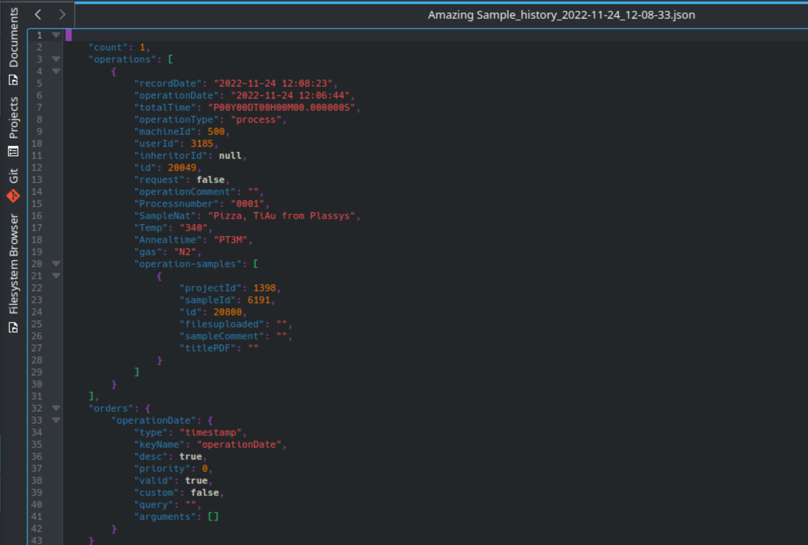
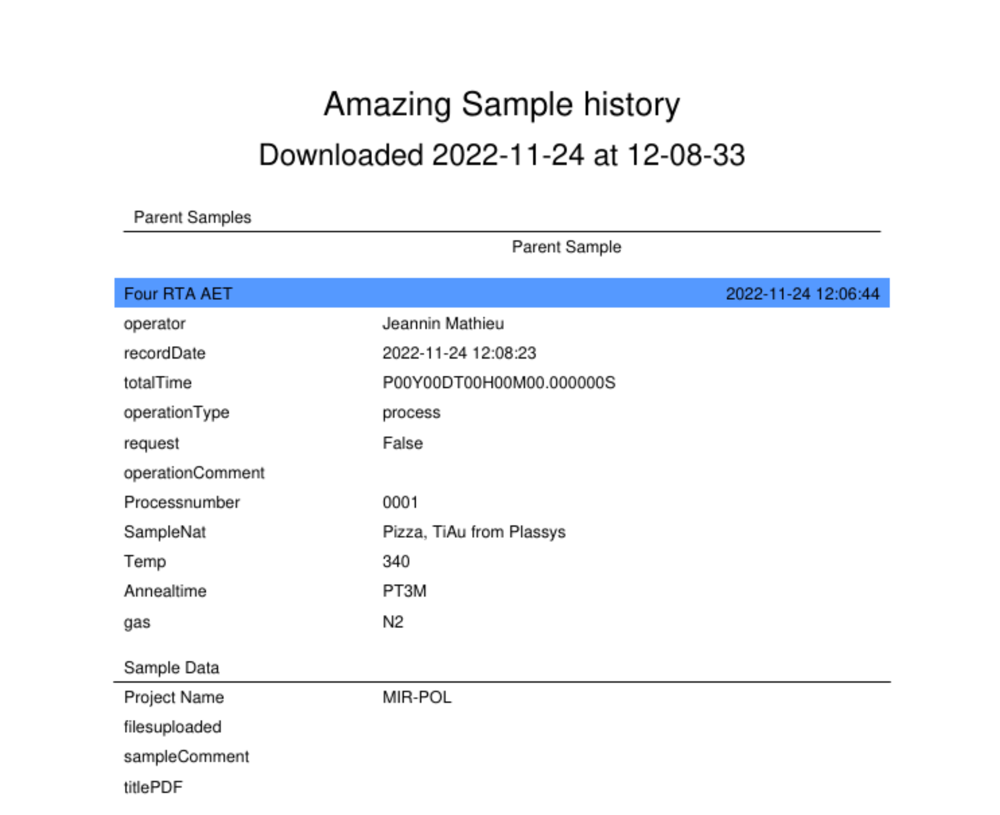

.. DigiclearJSONConverter documentation master file, created by
   sphinx-quickstart on Tue Jun 21 22:55:25 2022.
   You can adapt this file completely to your liking, but it should at least
   contain the root `toctree` directive.

Welcome to DigiclearJSONConverter's documentation!
==================================================

This module aims at expanding some of Digiclear's functionnalities by allowing you to save the process flow of a sample in a PDF file.
Sample history is available in Digiclear, and can be exported as a JSON file. While this is practical from a computer point of view, it is not super user friendly and human-readable.

.. warning::
   This program comes without any warranty. This is especially true for standalone executables that are automatically generated. Further development of this software will (hopefully !) improve robustness and compatibility for all users.

What do I get
-------------

Let's start by demonstrating what this program does.
Starting from a sample history [#f1]_ that you downloaded from digiclear, in JSON format such as:

The program converts it to a PDF:

The title of the PDF is the sample name and the date/time at which the file was downloaded. If the sample inherits from one or several parent samples, they will be listed on top. Then each process step is simply listed in chronological order (i.e. oldest steo first).

.. [#f1] No gold-coated pizza was actually cooked in the RTA oven.

.. toctree::
   :maxdepth: 2
   :caption: Contents:
   
   Installation
   Basic Usage
   FAQ

API Reference
--------------

.. autosummary::
   :toctree: _autosummary
   :template: custom-module-template.rst
   :recursive:
   
   DigiclearJSONConverter

Indices and tables
==================

* :ref:`genindex`
* :ref:`modindex`
* :ref:`search`
